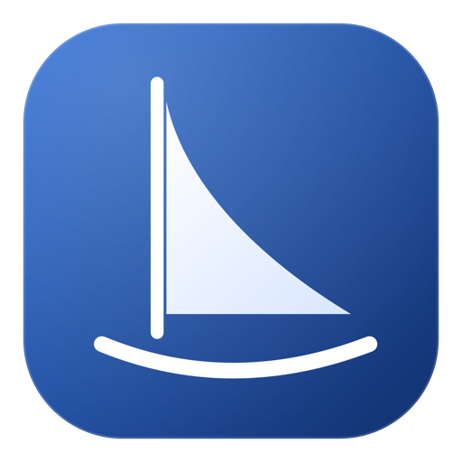
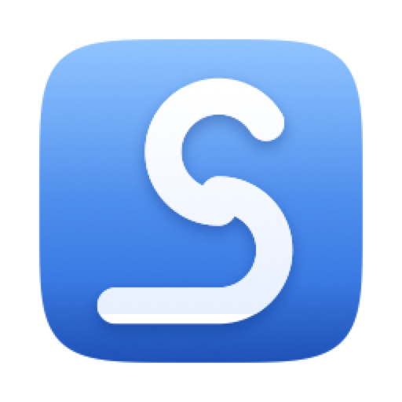
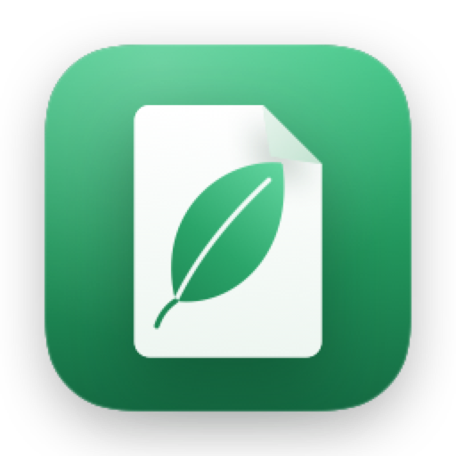
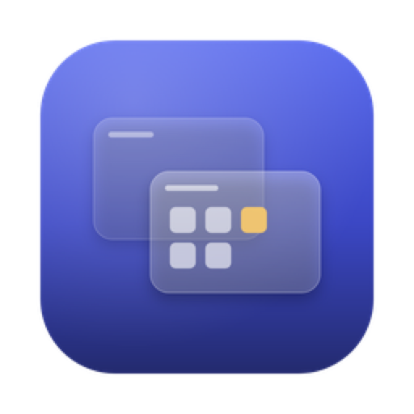
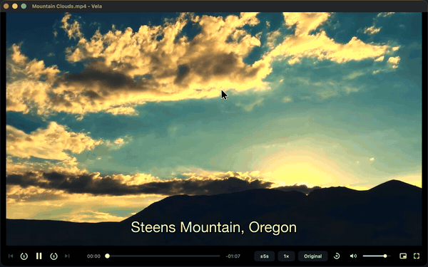
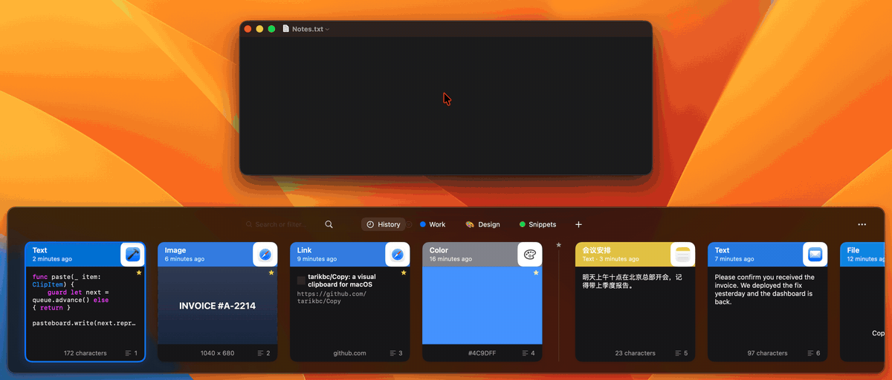
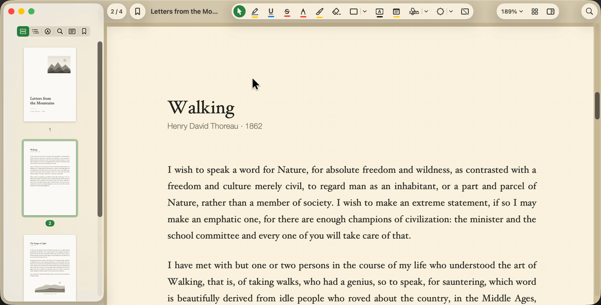
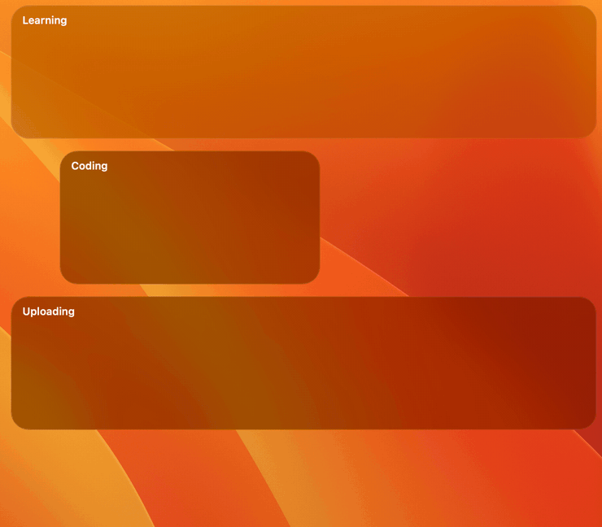
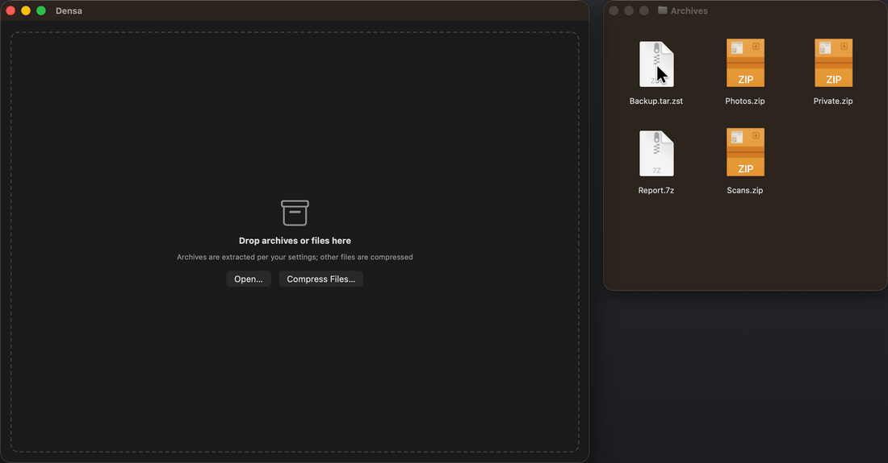

<p align="right"><a href="README.zh-CN.md">中文</a></p>

<p align="center">
  &nbsp;&nbsp;
  &nbsp;&nbsp;
  &nbsp;&nbsp;
  &nbsp;&nbsp;
  
</p>

# Annfeng Studio

Welcome to Annfeng Studio, a small collection of independent apps in pursuit of experiences that are pure and useful.

Here you will find the tools I build for the Apple ecosystem: Vela, Stela, Folia, Clara and Densa. As you may have noticed, every name ends in the letter "a". It is a small naming habit, and it ties them to a shared intent: to lean toward Apple's understated aesthetic, to stay simple and easy to use, and never to carry ads.

I believe a good tool should feel as natural as breathing: invisible most of the time, and genuinely helpful the moment you need it. May these light tools bring a little restraint and efficiency to your digital life.

| Icon | App | Description | Requires | Latest |
|:-:|---|---|---|---|
|  | [Vela](#vela) | A quiet video player | macOS 12 or later, Apple silicon | [Vela 0.5.9](https://github.com/AnnFengDeYe/annfeng-studio/releases/download/vela-v0.5.9/Vela-0.5.9-macos-arm64.dmg) |
|  | [Stela](#stela) | A clipboard manager in the spirit of Paste | macOS 14 or later | [Stela 1.0.1](https://github.com/AnnFengDeYe/annfeng-studio/releases/download/stela-v1.0.1/Stela-1.0.1.dmg) |
|  | [Folia](#folia) | A pure, native PDF reader and annotator | macOS 26 or later | [Folia 1.0.1](https://github.com/AnnFengDeYe/annfeng-studio/releases/download/folia-v1.0.1/Folia-1.0.1.dmg) |
|  | [Clara](#clara) | A light desktop-zone organizer for the Mac | macOS 15 or later | [Clara 1.2.0](https://github.com/AnnFengDeYe/annfeng-studio/releases/download/clara-v1.2.0/Clara-1.2.0.zip) |
|  | [Densa](#densa) | A minimal native archive utility for macOS | macOS 14 or later | [Densa 0.1.0](https://github.com/AnnFengDeYe/annfeng-studio/releases/download/densa-v0.1.0/Densa-0.1.0.zip) |

All installers live on the [Releases](https://github.com/AnnFengDeYe/annfeng-studio/releases) page. Installation notes are at the end.

---

## Vela

<p align="center"></p>

A quiet video player. It keeps the full VLC engine behind an interface that is nothing more than a thin progress bar and a few line icons, so every format, subtitle and hardware-decoding capability comes along. Beneath that restraint sits real freedom: skip length, playback speed (0.1× to 8×) and aspect ratio are all yours to set, and seamless rotation, an always-on-top picture-in-picture window, automatic subtitle loading and folder playback make for a pure, focused and genuinely comfortable way to watch.

Requires macOS 12 or later on Apple silicon. Download: [Vela-0.5.9-macos-arm64.dmg](https://github.com/AnnFengDeYe/annfeng-studio/releases/download/vela-v0.5.9/Vela-0.5.9-macos-arm64.dmg)

---

## Stela

<p align="center"></p>

An intuitive clipboard manager that keeps everything on your Mac. Summon the shelf and the text, images, links and files you have copied rise from the bottom of the screen as cards tinted with their source app's color. A capable on-device search finds things in an instant, whether you type pinyin initials, traditional or simplified characters, a misspelled English word, or something that only appeared inside a screenshot, read by local OCR. Plain-text pasting, number shortcuts, Pinboards for favorites and automatic hiding during screen sharing round it out, with no telemetry and nothing uploaded, so keeping and recalling the fragments of your day becomes natural and unhurried.

Requires macOS 14 or later. Download: [Stela-1.0.1.dmg](https://github.com/AnnFengDeYe/annfeng-studio/releases/download/stela-v1.0.1/Stela-1.0.1.dmg)

---

## Folia

<p align="center"></p>

A pure, native PDF reader and annotator. With no third-party dependencies at all, it folds a complete annotation toolkit (highlights, handwriting, signatures, stamps and more) and flexible page management into a light native frame. The window shifts between light and dark with the paper you are reading, so nothing jars the eye, and deep support for Mac trackpad gestures and shortcuts lets focused reading and heavy annotation alike flow in one unbroken motion.

Requires macOS 26 or later. Download: [Folia-1.0.1.dmg](https://github.com/AnnFengDeYe/annfeng-studio/releases/download/folia-v1.0.1/Folia-1.0.1.dmg)

---

## Clara

<p align="center"></p>

A light, restrained way to tidy the Mac desktop. It draws elegant frosted-glass zones on the desktop and gathers scattered icons into orderly groups, without ever changing where a file actually lives. Every drag and resize comes with Keynote-smooth guides and edge snapping, and a clever Collect feature sends new screenshots and downloads straight into the zone you choose. It asks for only the most basic access, keeps every native Finder habit intact, and quietly gives you back a desktop that is tidy, lively and pleasingly ordered.

Requires macOS 15 or later. Download: [Clara-1.2.0.zip](https://github.com/AnnFengDeYe/annfeng-studio/releases/download/clara-v1.2.0/Clara-1.2.0.zip)

---

## Densa

<p align="center"></p>

A light yet capable native archive utility for macOS. It blends quietly into the system and handles thirty-odd archive formats. There is no need to wait for a full extraction: search inside the window, preview with the space bar, or drag out exactly the file you want, and legacy filename encodings are detected automatically, so garbled names are a thing of the past. With a deep Finder extension, careful safety checks and a brisk, simple flow, it turns packing and unpacking into a seamless, worry-free native experience.

Requires macOS 14 or later. Download: [Densa-0.1.0.zip](https://github.com/AnnFengDeYe/annfeng-studio/releases/download/densa-v0.1.0/Densa-0.1.0.zip)

---

## Installing

Open the .dmg and drag the app into Applications; for a .zip, unzip it and do the same.

The apps are signed with a developer certificate but not yet notarized by Apple, so macOS stops the first launch once. Right-click the app and choose Open, or go to System Settings › Privacy & Security and click Open Anyway; it will not ask again. Or, in Terminal:

```sh
xattr -dr com.apple.quarantine /Applications/Vela.app
```

Permissions on first run: Stela needs Accessibility to paste into the frontmost app; Clara needs access to the Desktop folder.
