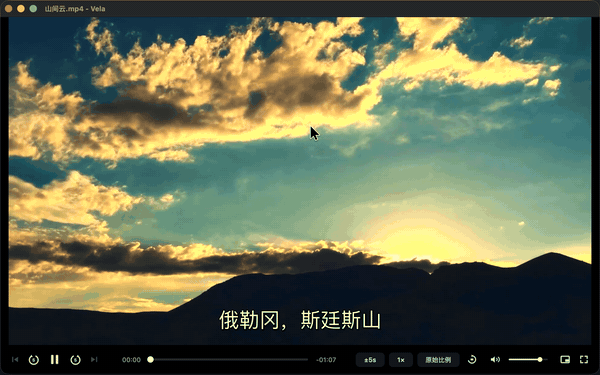
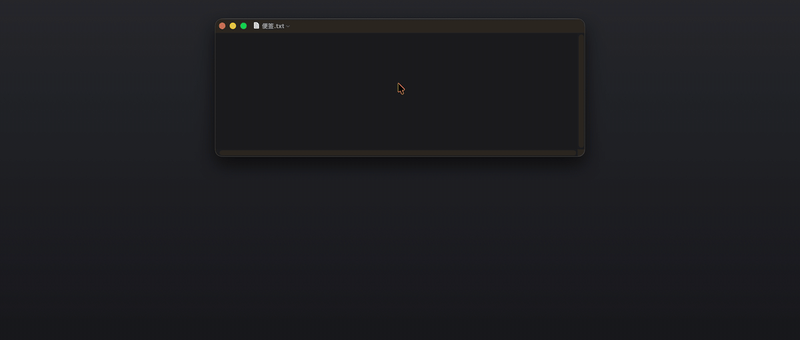
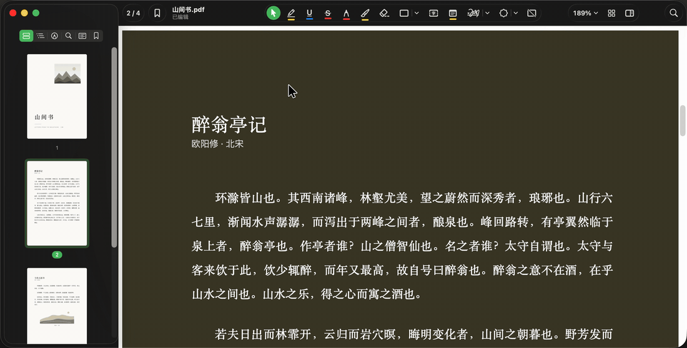
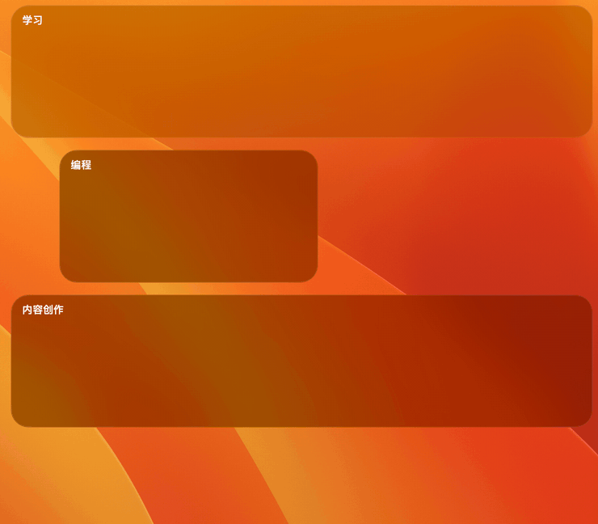
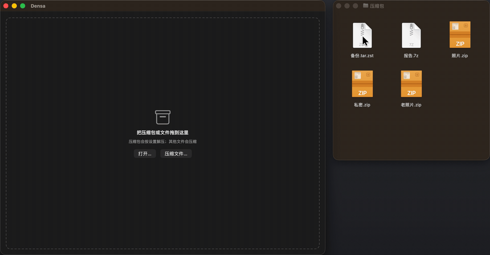

<p align="right"><a href="README.en.md">English</a></p>

<p align="center">
  &nbsp;&nbsp;
  &nbsp;&nbsp;
  &nbsp;&nbsp;
  &nbsp;&nbsp;
  
</p>

# Annfeng Studio

欢迎来到 Annfeng Studio —— 致力于探索纯粹与实用体验的独立应用集。

这里收录了我个人开发的一系列苹果生态工具：Vela、Stela、Folia、Clara、Densa。如你所见，它们都以字母 "a" 作为结尾。这算是一个小小的命名习惯，也连接着它们相同的初衷：在设计上努力向苹果的简约美学靠拢，坚持极简易用，且永远没有广告。

我相信，好的工具应当如呼吸般自然——平时隐于无形，却能在你需要时提供切实的帮助。愿这些轻巧的工具，能为你的数字生活带来一份克制与高效。

| | 应用 | 一句话 | 系统要求 | 下载 |
|:-:|---|---|---|---|
|  | [Vela](#vela) | 一个安静的视频播放器 | macOS 12 及以上，Apple 芯片 | [Vela 0.5.9](https://github.com/AnnFengDeYe/annfeng-studio/releases/download/vela-v0.5.9/Vela-0.5.9-macos-arm64.dmg) |
|  | [Stela](#stela) | 复刻 Paste 体验的剪贴板管理器 | macOS 14 及以上 | [Stela 1.0.1](https://github.com/AnnFengDeYe/annfeng-studio/releases/download/stela-v1.0.1/Stela-1.0.1.dmg) |
|  | [Folia](#folia) | 原生的 PDF 阅读与批注 | macOS 26 及以上 | [Folia 1.0.1](https://github.com/AnnFengDeYe/annfeng-studio/releases/download/folia-v1.0.1/Folia-1.0.1.dmg) |
|  | [Clara](#clara) | 给 Mac 桌面划出分区 | macOS 15 及以上 | [Clara 1.2.0](https://github.com/AnnFengDeYe/annfeng-studio/releases/download/clara-v1.2.0/Clara-1.2.0.zip) |
|  | [Densa](#densa) | 三十余种格式的压缩与解压 | macOS 14 及以上 | [Densa 0.1.0](https://github.com/AnnFengDeYe/annfeng-studio/releases/download/densa-v0.1.0/Densa-0.1.0.zip) |

全部安装包都在 [Releases](https://github.com/AnnFengDeYe/annfeng-studio/releases) 页面，安装方法见文末。

---

## Vela

<p align="center"></p>

安静的视频播放器。它将强大的 VLC 内核隐藏在只有细进度条与线性图标的极简界面之下，全面保留了全格式、多字幕与硬解支持。在克制的视觉外表下，它赋予了极大的播放自由度：快进步长、倍速（0.1×至8×）与画面比例均可随心设定；配合无缝旋转、置顶画中画、自动加载字幕与同目录连播等贴心功能，为你带来纯粹、专注且高度顺手的沉浸式观影体验。

系统要求：macOS 12 及以上，Apple 芯片。下载：[Vela-0.5.9-macos-arm64.dmg](https://github.com/AnnFengDeYe/annfeng-studio/releases/download/vela-v0.5.9/Vela-0.5.9-macos-arm64.dmg)

---

## Stela

<p align="center"></p>

直观且专注本地隐私的剪贴板管理器。唤出面板，你复制过的文本、图片、链接或文件都会化作一张张带有来源应用主题色的彩色卡片，从屏幕底部优雅升起。它内置了极为强大的纯本地检索引擎——无论是中文拼音首字母、简繁体、英文模糊拼写，还是截图里的文字（本机 OCR），都能帮你瞬间精准定位。结合纯文本粘贴、数字快捷键、常用收藏库（Pinboard）以及屏幕共享自动隐藏等贴心细节，在完全无遥测、数据零上传的安全前提下，让碎片信息的留存与调用变得自然而从容。

系统要求：macOS 14 及以上。下载：[Stela-1.0.1.dmg](https://github.com/AnnFengDeYe/annfeng-studio/releases/download/stela-v1.0.1/Stela-1.0.1.dmg)

---

## Folia

<p align="center"></p>

纯粹的原生 PDF 阅读与批注工具。它坚持零第三方库依赖，将全套的批注编辑（高亮、手写、签名、图章等）与灵活的页面重组功能，完美融入轻盈的原生框架中。应用界面会随着阅读纸张的主题色智能切换明暗，带来舒适不突兀的视觉沉浸感；同时它深度适配了 Mac 的触控板手势与快捷键，无论是专注阅读还是深度批注，都能为你提供自然流畅、一气呵成的文档处理体验。

系统要求：macOS 26 及以上。下载：[Folia-1.0.1.dmg](https://github.com/AnnFengDeYe/annfeng-studio/releases/download/folia-v1.0.1/Folia-1.0.1.dmg)

---

## Clara

<p align="center"></p>

轻巧克制的 Mac 桌面整理工具。它用优雅的磨砂玻璃质感在桌面上划出专属分区，帮你将繁杂的图标进行井然有序的视觉归组，而绝不会改变文件的真实存储路径。每一次拖拽与缩放，都伴随着如 Keynote 般丝滑的参考线对齐与边缘吸附；聪明的“自动收纳”功能，更能让新产生的截图或下载文件瞬间落入指定区域。在仅需最基本访问权限的安全前提下，它完美保留了所有 Finder 的原生操作习惯，为你从容重塑一个整洁、灵动且极具秩序美的桌面环境。

系统要求：macOS 15 及以上。下载：[Clara-1.2.0.zip](https://github.com/AnnFengDeYe/annfeng-studio/releases/download/clara-v1.2.0/Clara-1.2.0.zip)

---

## Densa

<p align="center"></p>

轻盈且强大的 macOS 原生解压缩工具。它安静地融入系统之中，为你提供对三十余种归档格式的全面支持。无需漫长的解压等待，你可以直接在窗口内搜索、空格预览，或精准拖出压缩包内的任意单个文件；它还能聪明地自动识别各种历史编码，让恼人的乱码从此绝迹。配合深度的 Finder 右键扩展、严密的安全防护与轻快的操作逻辑，它将繁琐的文件打包与解包化繁为简，为你带来安全、无缝且极度省心的原生级体验。

系统要求：macOS 14 及以上。下载：[Densa-0.1.0.zip](https://github.com/AnnFengDeYe/annfeng-studio/releases/download/densa-v0.1.0/Densa-0.1.0.zip)

---

## 安装

打开 .dmg 后把应用拖进「应用程序」，.zip 解压后同样拖入即可。

这些应用使用开发者证书签名，尚未经过 Apple 公证，所以第一次打开时 macOS 会拦一次。在应用图标上右键选择「打开」，或者到「系统设置 › 隐私与安全性」点「仍要打开」，之后就不会再问。也可以在终端里执行：

```sh
xattr -dr com.apple.quarantine /Applications/Vela.app
```

首次运行需要的权限：Stela 需要「辅助功能」授权，用来把内容粘贴到前台 App；Clara 需要桌面文件夹的访问权限。

## 隐私

没有广告，没有遥测。除了可以关闭的功能（Stela 的链接预览、Densa 的更新检查）之外，它们不访问网络。

## 致谢

- 演示视频《Time Lapse Clouds above Steens Mountain》由美国土地管理局拍摄，公有领域，来自 [Wikimedia Commons](https://commons.wikimedia.org/wiki/File:Time_Lapse_Clouds_above_Steens_Mountain_(36203941112).webm)。
- 演示 PDF 中的文字为欧阳修《醉翁亭记》、吴均《与朱元思书》、柳宗元《小石潭记》，以及 Thoreau、Muir、Emerson 的散文，均为公有领域。
- Stela 基于 [tarikbc/Copy](https://github.com/tarikbc/Copy)（GPL-3.0）开发，以 GPL-3.0 发布，源代码见 [AnnFengDeYe/stela](https://github.com/AnnFengDeYe/stela)。
- Vela 使用 [libVLC](https://www.videolan.org/vlc/libvlc.html)（LGPL 2.1）、[Qt](https://www.qt.io)（LGPL 3）与 OpenSSL；Densa 使用 [libarchive](https://www.libarchive.org) 与 [7-Zip](https://www.7-zip.org)（LGPL）。
